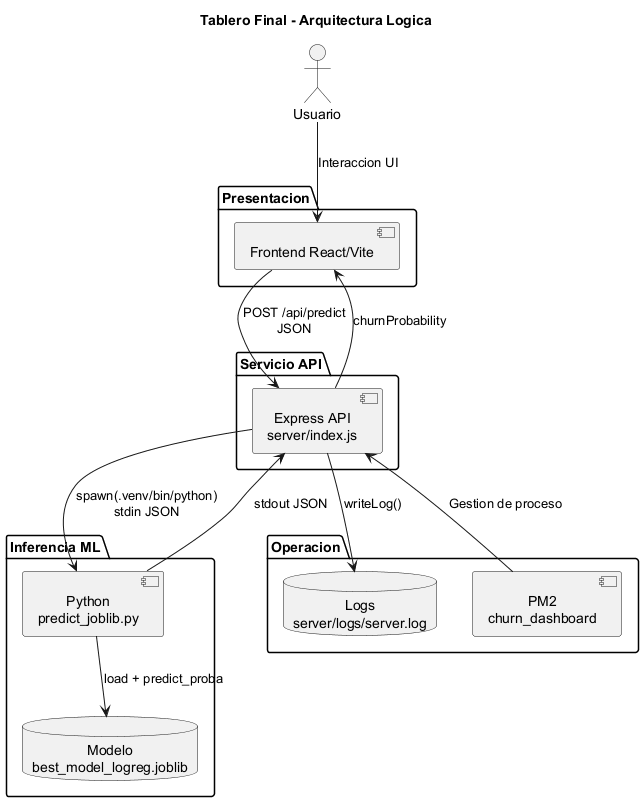
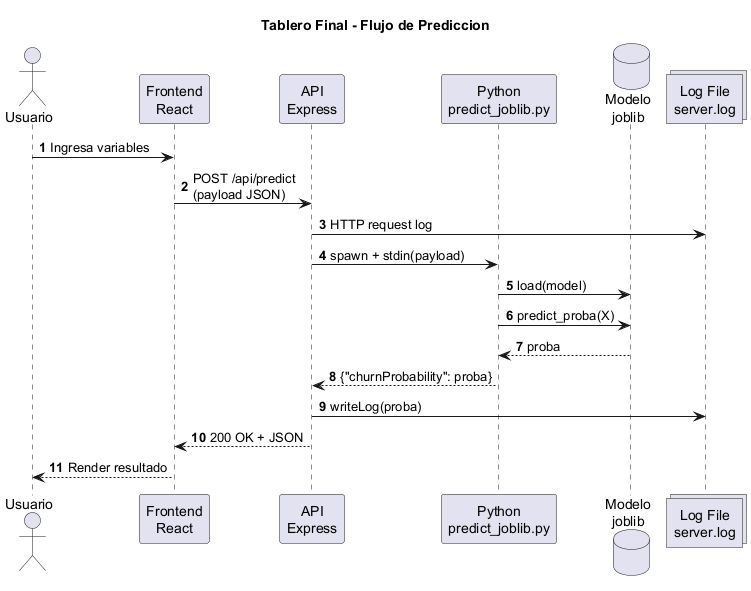
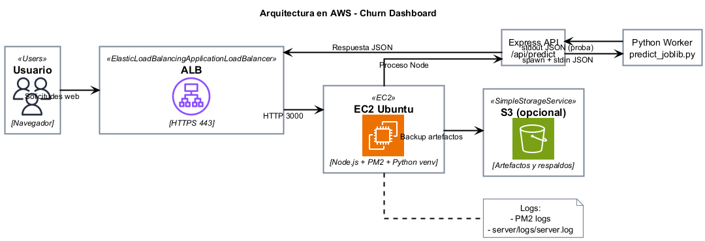
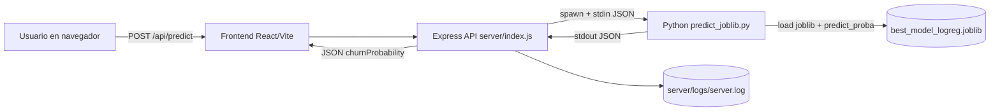

# Tablero Final - Churn Dashboard

Dashboard web para estimar la probabilidad de churn de clientes de Olist usando un modelo de machine learning (`joblib`) servido por Node.js + Python.

## Descripcion del proyecto

Este proyecto contiene:

- Frontend en Vite/React para capturar variables del cliente y visualizar el resultado.
- Backend en Express con endpoint `POST /api/predict`.
- Script Python (`server/predict_joblib.py`) que carga el modelo y retorna la probabilidad de churn.
- Despliegue en EC2 con PM2 y entorno virtual de Python.

Flujo de prediccion:

1. El frontend envia datos al endpoint `/api/predict`.
2. Node.js ejecuta Python (`spawn`) dentro de `.venv`.
3. Python carga el modelo `best_model_logreg.joblib`.
4. Python retorna JSON con `churnProbability`.
5. Node responde al frontend y registra logs en `server/logs/server.log`.

## Arquitectura

### Diagramas (PlantUML)

Para renderizar las imagenes localmente:

```bash
plantuml -tpng docs/diagrams/architecture.puml docs/diagrams/request_flow.puml docs/diagrams/aws_architecture.puml
```

Arquitectura logica:



Flujo de prediccion:



Arquitectura en AWS (iconos AWS):



### Capas logicas

1. Presentacion:
- Frontend React/Vite renderizado en el navegador.
- Captura variables de entrada del cliente y consume la API.

2. Servicio API:
- Express en `server/index.js` expone `POST /api/predict`.
- Mapea payload del frontend al esquema requerido por el modelo.
- Orquesta la ejecucion del proceso Python con `spawn`.

3. Inferencia ML:
- Script `server/predict_joblib.py` valida entrada.
- Carga el modelo `best_model_logreg.joblib`.
- Ejecuta `predict_proba` y retorna JSON.

4. Operacion y observabilidad:
- PM2 gestiona ciclo de vida del proceso Node.
- `server/logs/server.log` centraliza logs de HTTP y prediccion.

### Topologia de ejecucion (EC2)

- Host: instancia EC2 Ubuntu.
- Puerto API/App: `3000`.
- Runtime Node: proceso `churn_dashboard` en PM2.
- Runtime Python: proceso hijo por request (`spawn`) usando `server/.venv/bin/python`.
- Artefacto modelo: `server/best_model_logreg.joblib`.
- Build frontend: `dist/` servido por Express.

### Diagrama de flujo



### Contrato de datos

- Entrada esperada por el backend:
  - `recency` o `Recency`
  - `frequency` o `Frequency`
  - `monetary` o `Monetary`
  - `avg_review_score`
  - `avg_delivery_days`
  - `avg_late_days`
  - `avg_num_items`
  - `avg_price_sum`
  - `avg_freight_sum`
  - `customer_state`

- Salida:
  - `churnProbability` (float entre 0 y 1)

## Requisitos

- Ubuntu (recomendado en EC2).
- Git.
- Node.js + npm.
- Python 3.12 con `venv` y `pip`.
- PM2.

## Estructura relevante

- `deploy_churn_dashboard.sh`: automatiza build y despliegue.
- `server/index.js`: API Express y ejecucion de Python.
- `server/predict_joblib.py`: inferencia del modelo.
- `server/requirements.txt`: dependencias Python.
- `server/logs/server.log`: log de aplicacion.

## Instalacion paso a paso (Ubuntu/EC2)

### 1. Actualizar sistema

```bash
sudo apt update
```

### 2. Instalar Node.js y npm

```bash
sudo apt install -y nodejs npm
node -v
npm -v
```

### 3. Instalar PM2 global

```bash
sudo npm i -g pm2
pm2 -v
```

### 4. Configurar arranque automatico de PM2

```bash
pm2 startup systemd -u ubuntu --hp /home/ubuntu
pm2 save
```

Nota: el comando `pm2 startup ...` suele imprimir otro comando con `sudo`. Ejecutalo exactamente como te lo muestre en pantalla.

### 5. Instalar Python 3 + venv + pip

```bash
sudo apt install -y python3.12-venv python3-pip
python3 --version
python3 -m pip --version
```

### 6. Clonar o actualizar repositorio

```bash
cd /home/ubuntu
git clone <URL_DEL_REPO> Microproyecto_proyectogrado
cd /home/ubuntu/Microproyecto_proyectogrado
```

Si ya existe el repo:

```bash
cd /home/ubuntu/Microproyecto_proyectogrado
git pull --ff-only
```

### 7. Ejecutar deploy automatico

```bash
cd /home/ubuntu/Microproyecto_proyectogrado/Tablero_final
bash deploy_churn_dashboard.sh
```

Este script:

- Instala dependencias frontend/backend.
- Compila Vite.
- Crea y/o repara `.venv` en `server/.venv`.
- Instala dependencias Python desde `server/requirements.txt`.
- Inicia PM2 con `churn_dashboard`.

## Comandos de operacion

### Ver estado

```bash
pm2 status
pm2 show churn_dashboard
```

### Ver logs PM2

```bash
pm2 logs churn_dashboard --lines 100
```

### Ver logs de aplicacion

```bash
tail -f /home/ubuntu/Microproyecto_proyectogrado/Tablero_final/server/logs/server.log
```

### Reiniciar servicio

```bash
pm2 restart churn_dashboard --update-env
```

### Eliminar y recrear proceso

```bash
pm2 delete churn_dashboard
pm2 start /home/ubuntu/Microproyecto_proyectogrado/Tablero_final/server/index.js --name churn_dashboard --update-env
pm2 save
```

## Prueba del endpoint

```bash
curl -sS -X POST http://127.0.0.1:3000/api/predict \
  -H "Content-Type: application/json" \
  -d '{"recency":32,"frequency":5,"monetary":500,"avg_review_score":4,"avg_delivery_days":10,"avg_late_days":0,"avg_num_items":2,"avg_price_sum":100,"avg_freight_sum":15,"customer_state":"SP"}'
```

Respuesta esperada:

```json
{"churnProbability": 0.1234}
```

## Troubleshooting rapido

### Error: `ERR_HTTP_HEADERS_SENT`

Causa: doble respuesta HTTP en el mismo request.

Accion:

```bash
cd /home/ubuntu/Microproyecto_proyectogrado
git pull --ff-only
pm2 restart churn_dashboard --update-env
pm2 logs churn_dashboard --lines 100
```

### Error de pandas/joblib no encontrado

Verifica que el proceso use el Python de `server/.venv` y que dependencias esten instaladas:

```bash
/home/ubuntu/Microproyecto_proyectogrado/Tablero_final/server/.venv/bin/python -c "import pandas, joblib, sklearn; print('ok')"
```

Si falla:

```bash
cd /home/ubuntu/Microproyecto_proyectogrado/Tablero_final/server
source .venv/bin/activate
python -m pip install -r requirements.txt
pm2 restart churn_dashboard --update-env
```

### No se ven requests en `server.log`

1. Verifica que haces `tail` al archivo correcto.
2. Genera trafico con `curl`.
3. Confirma que PM2 ejecuta el script correcto con `pm2 show churn_dashboard`.

## Seguridad y buenas practicas

- Restringe Security Group (EC2) a los puertos necesarios.
- Usa HTTPS con Nginx/ALB en produccion.
- No subas secretos a git (`.env` debe estar protegido).
- Versiona y respalda tu modelo (`joblib`) de forma controlada.

## Licencia

Uso academico / interno del proyecto.
